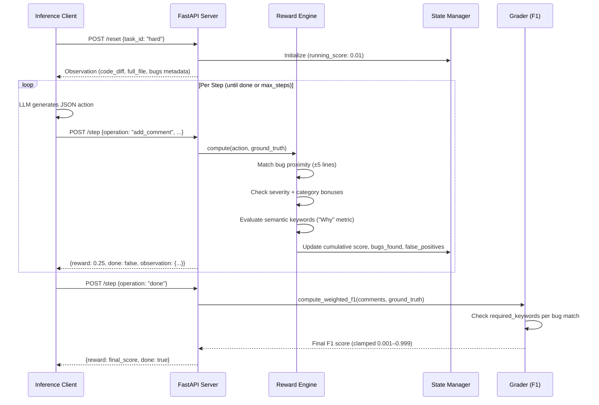

# Code Review OpenEnv: Architecture Blueprint & Technical Documentation

This document serves as the exhaustive architectural reference, logic flow mapping, and operational blueprint for the **Code Review OpenEnv** system. It details the internal engine design, component-level workflows, robust fault-tolerance handling, strict mathematical boundary checks, and the testing validation infrastructure.

---

## 1. System Architecture Overview

The Code Review OpenEnv is designed as a highly cohesive but loosely coupled client-server architecture mimicking real-world software engineering environments.

### Core Components

| Component | File | Responsibility |
|---|---|---|
| **FastAPI Server** | `server.py` | Authoritative state machine. Exposes `POST /reset`, `POST /step`, `GET /state` |
| **Environment Engine** | `env/environment.py` | Central routing hub passing commands through evaluation |
| **Reward Engine** | `env/reward_engine.py` | The "heart" — precision/recall + semantic keyword scoring |
| **State Manager** | `env/state_manager.py` | Transactional memory: cumulative rewards, comments, step history |
| **Graders** | `env/graders/` | Per-task weighted F1 calculators with semantic keyword gates |
| **Task Definitions** | `env/tasks/` | Ground-truth bug definitions with `required_keywords` |
| **Inference Client** | `inference.py` | LLM orchestration, JSON extraction, token routing |
| **Benchmark Runner** | `benchmark_models.py` | Multi-model evaluation orchestrator |
| **Data Models** | `env/models.py` | Pydantic schemas for actions, observations, rewards, bugs |

### Directory Structure
```
code-reviewer/
├── server.py                    # FastAPI application entry point
├── inference.py                 # LLM inference runner
├── benchmark_models.py          # Multi-model benchmarking orchestrator
├── openenv.yaml                 # OpenEnv specification manifest
├── Dockerfile                   # Container build definition
├── FINDINGS_PAPER.md            # Academic findings paper
├── ARCHITECTURE_BLUEPRINT.md    # This file
├── code-review-env/
│   ├── env/
│   │   ├── environment.py       # Core environment engine
│   │   ├── reward_engine.py     # Shaped reward computation
│   │   ├── state_manager.py     # Episode state tracking
│   │   ├── models.py            # Pydantic data schemas
│   │   ├── graders/
│   │   │   ├── base_grader.py   # F1 math with semantic gates
│   │   │   ├── grader_easy.py   # Easy task grader
│   │   │   ├── grader_medium.py # Medium task grader
│   │   │   └── grader_hard.py   # Hard task grader
│   │   └── tasks/
│   │       ├── task_easy.py     # 3 runtime logic bugs
│   │       ├── task_medium.py   # 4 security vulnerabilities
│   │       └── task_hard.py     # 4 crypto/async bugs + 1 red herring
│   └── tests/
│       ├── test_environment.py
│       ├── test_rewards.py
│       ├── test_graders.py
│       ├── test_advanced_cases.py
│       ├── test_comprehensive.py
│       ├── test_api.py
│       └── test_inference_helpers.py
```

---

## 2. Logic Flows & The Execution Lifecycle

The evaluation pipeline follows a deterministic state machine structure:



### Step-by-Step Reward Computation

1. **Line Matching**: Agent's `line_number` is compared to all ground-truth bugs. Closest match within ±5 lines wins.
2. **Red Herring Check**: If the matched bug has `is_red_herring=True`, return `-0.20` immediately.
3. **Duplicate Check**: If the bug line was already credited, return `-0.05`.
4. **Base Reward**: `+0.15` for a correct proximity match.
5. **Severity Bonus**: `+0.05` if agent's severity matches ground truth.
6. **Category Bonus**: `+0.05` if agent's category matches ground truth.
7. **Semantic "Why" Check**: If the bug has `required_keywords`, scan the agent's `message` for any keyword match. If none found, apply `-0.10` penalty and do NOT register the bug as fully identified.

---

## 3. The Semantic "Why" Metric (Novel Contribution)

Traditional code review environments evaluate only *what* an agent flags. Our environment introduces a novel dimension: evaluating whether the agent understands *why* something is a bug.

### How It Works

Each `GroundTruthBug` can optionally include a `required_keywords` list:

```python
GroundTruthBug(
    line_number=27,
    severity="critical",
    category="security",
    description="Use of insecure ECB mode for AES encryption.",
    required_keywords=["ecb", "mode", "insecure", "cbc", "iv", "gcm"]
)
```

When an agent comments on this line, the reward engine scans the agent's `message` text for any of these keywords (case-insensitive). If the agent says *"This line has a bug"* without mentioning ECB, CBC, or any cipher-mode terminology, it receives only partial credit and the bug is **not registered as found** for final F1 scoring.

### Impact on Scoring

| Scenario | Step Reward | Bug Registered? |
|---|---|---|
| Correct line + correct severity + has keyword | +0.25 | ✅ Yes |
| Correct line + correct severity + **missing keyword** | +0.15 | ❌ No |
| Correct line + wrong severity + has keyword | +0.20 | ✅ Yes |

This creates a meaningful capability gap between models that truly understand software engineering concepts and models that merely pattern-match line numbers.

---

## 4. Task Design Philosophy

### Easy: List Processing (3 bugs)
Classic Python logic errors that any competent developer should catch. Tests basic code comprehension.

### Medium: Web Handler Security (4 bugs)
Real-world OWASP-style vulnerabilities. Tests security awareness depth.

### Hard: Async Cryptographic Service (4 bugs + 1 red herring)
A highly concurrent background worker that:
- Parses YAML configs (Bug: `yaml.load` → `yaml.safe_load`)
- Decrypts AES tokens (Bug: ECB mode instead of CBC/GCM)
- Streams audit data (Bug: AsyncGenerator not closed)
- Caches to global dict (Bug: Race condition without `asyncio.Lock`)
- Retries network calls (Red Herring: `except: pass` inside a retry-backoff is intentional)

The hard task is specifically designed so that even frontier 70B+ models score in the 0.056–0.084 range, revealing meaningful capability differences. In our benchmark, the code-specialized DeepSeek-Coder-V2 scored lowest (0.056), while Mixtral-8x7B and Gemma-2-27B tied highest (0.084).

---

## 5. Strict Mathematical Boundary Compliance

OpenEnv validators demand all scores strictly between 0 and 1 (exclusive). Our defense-in-depth approach:

| Layer | Mechanism | Bounds |
|---|---|---|
| **F1 Graders** | `max(0.001, min(0.999, round(f1, 4)))` | (0.001, 0.999) |
| **Environment Step** | `float(round(min(max(reward, 0.01), 0.99), 3))` | (0.01, 0.99) |
| **State API (`/state`)** | `max(0.001, min(0.999, cumulative_reward))` | (0.001, 0.999) |
| **Inference Logs** | `max(1e-6, min(score, 1 - 1e-6))` with `.3f` format | Never "0.000" or "1.000" |
| **Empty State Init** | `running_score: 0.01` | Never 0.0 |

---

## 6. Fault Handling & Error Resilience

### HTTP 402 API Depletion
When the HF Router returns credit depletion mid-episode:
1. Exception is caught in `inference.py`
2. Agent auto-submits `{"operation": "done"}` gracefully
3. Episode completes with a valid, bounded score
4. No crash, no timeout, no validator failure

### Malformed LLM Output
When the LLM generates conversational text instead of JSON:
1. Regex extractors locate `{...}` JSON clusters within the response
2. Markdown code fences are stripped automatically
3. Missing fields trigger `-0.05` penalty (not a server crash)

### Division-by-Zero Protection
Both F1 functions (`compute_f1`, `compute_weighted_f1`) handle:
- Zero comments submitted → returns `0.001` (not `0.0`)
- Zero bugs found → returns `0.001` (not `0.0`)

---

## 7. Multi-Model Benchmarking Infrastructure

The `benchmark_models.py` orchestrator enables head-to-head comparisons:

```python
MODELS = [
    "deepseek-ai/DeepSeek-Coder-V2-Instruct",
    "Qwen/Qwen2.5-72B-Instruct",
    "meta-llama/Llama-3-70b-chat-hf",
    "mistralai/Mixtral-8x7B-Instruct-v0.1",
    "google/gemma-2-27b-it",
]
```

Features:
- **Progressive saving**: Results written to `benchmark_results.json` after each model
- **Skip completed**: Already-benchmarked models are skipped on re-run
- **Rate limit cooling**: 15-second pause between models to respect API quotas
- **Timeout protection**: 300-second subprocess timeout per model run

---

## 8. Testing Infrastructure

52 automated tests across 8 test files:

| Test File | Coverage |
|---|---|
| `test_environment.py` | End-to-end episode lifecycle, state transitions |
| `test_rewards.py` | Positive/negative reward bounds, efficiency bonuses |
| `test_graders.py` | F1 computation, weighted scoring, boundary clamping |
| `test_advanced_cases.py` | Red herring penalties, semantic validation, API edge cases |
| `test_comprehensive.py` | Full multi-task episode simulations |
| `test_api.py` | FastAPI endpoint response codes, malformed input handling |
| `test_inference_helpers.py` | JSON extraction, format parsing |
| `test_performance_quality.py` | Latency budgets, endpoint stability, reward signal variance |

All tests enforce the strict `(0.01, 0.99)` reward boundary, guaranteeing OpenEnv Phase 2 compliance regardless of agent behavior.
